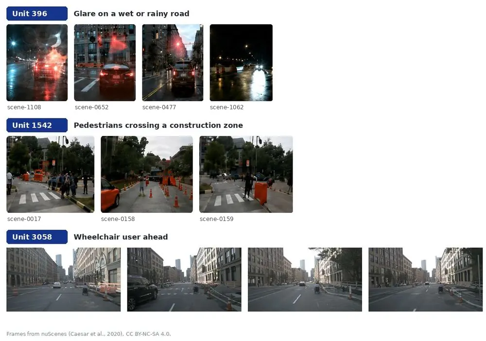

Long-Tail Driving Scene Discovery
=============
Welcome to the long-tail driving data mining project main page!
This page is about how to run this software.

#### Install

```bash
python -m venv .venv && source .venv/bin/activate
make install                      # pip install -r requirements.txt
```

#### Label

```bash
# Pre-label keyframes normal_core / not_normal_core / uncertain against the rubric
make label DATA=<nuscenes>
```

#### Extract

```bash
# Capture the VLM's layer-28 hidden state for every labelled keyframe
make extract DATA=<nuscenes> LAYERS=28
```

#### Train

```bash
# Train the tail-guided sparse autoencoder and evaluate it on the test scenes
make train
```

#### Explore the Neurons

```bash
# Web interface: which frames fire a unit, which units a frame fires
make explore DATA=<nuscenes>      # then open http://127.0.0.1:8765
```

#### Screen

```bash
# Flag long-tail frames in your own, unlabelled data
make screen RUN=output/sae_abstopk_tail_reward FEATURES=output/extract_mydata
```

#### Run Tests

```bash
make test                         # python -m pytest tests -q
```

#### Check Style

```bash
make lint                         # flake8, 100 columns
```

#### Clean the Project

```bash
make clean
```

Labelling and extraction need a CUDA GPU and a local copy of the VLM weights;
training, screening and the neuron explorer run on CPU. Every flag and every
file each command writes is documented in [`docs/user.md`](docs/user.md).

----------------

User page
=============
Welcome to the long-tail driving data mining project user main page!

This project finds rare, safety-critical driving scenes in large
autonomous-driving datasets by reading the internal representations of a
vision-language model, instead of relying on hand-written rules, keyword search,
anomaly scores or model uncertainty. A sparse autoencoder decomposes the model's
hidden state into a normal and a long-tail-sensitive subspace; a frame is
flagged when the long-tail subspace activates, and the units that fire say why.
The repository contains the whole pipeline — the annotation rubric and the
labeller, the hidden-state extractor, the sparse autoencoder with its
evaluation, a neuron explorer and a screening tool for new data. It was
developed by Yike Chen, Zihua Chen and Yusong Zhao as a capstone project at the
Chinese University of Hong Kong, Shenzhen.

# Abstract

Long-tail scenarios are rare but safety-critical in autonomous driving, and
their insufficient coverage remains a key obstacle to reliable deployment
[[1]](#ref-1). Existing mining methods rely on explicit semantic descriptions
[[4]](#ref-4), [[5]](#ref-5), anomaly scores [[6]](#ref-6), uncertainty
estimates [[8]](#ref-8), [[9]](#ref-9) or synthetic data [[10]](#ref-10), which
can miss visually subtle or high-confidence long-tail cases. This project
proposes a Sparse Autoencoder (SAE) framework for mining long-tail driving data
from the hidden representations of a frozen vision-language model. It adopts a
driving-behaviour-oriented definition, treating underrepresented samples that
require additional defensive-driving behaviour as long-tail candidates. Given a
driving sample, the method extracts internal hidden features from the frozen
VLM and trains a tail-guided SAE to decompose them into sparse normal and
long-tail-sensitive latent features. At inference, a sample is identified as a
long-tail candidate when the learned long-tail feature subspace is activated.
On nuScenes [[12]](#ref-12), the method raises long-tail F1 from 0.024 for the
same VLM prompted directly to 0.847, learns individual neurons that correspond
to specific risk patterns, and finds safety-critical samples that anomaly- and
uncertainty-based mining miss.

# Framework


The pipeline has six steps. **(1)** A single-frame, six-camera driving sample
**(2)** is read by a frozen vision-language model under a scene-description
prompt, and its layer-28 hidden state is averaged over tokens into one vector
*h*. **(3)** A sparse autoencoder encodes *h* into a sparse code split into a
normal part *z<sub>n</sub>* and a long-tail part *z<sub>t</sub>*; during
training, weak frame-level labels suppress *z<sub>t</sub>* on normal samples
and activate it on long-tail ones. **(4)** At inference, the number of active
long-tail units is counted and **(5)** a sample is long-tail as soon as one of
them fires. **(6)** The output is the list of mined samples, the named units
that fired for each, and the evaluation metrics.

# Why this problem

Driving data is dominated by lane following and ordinary traffic, while the
situations that decide whether an automated vehicle is safe are rare: unusual
pedestrian behaviour, construction zones, adverse weather, complex
interactions. Liu and Feng call this the *curse of rarity* and argue it is the
root cause of the safety challenge in autonomous-vehicle development
[[1]](#ref-1). The scenario space is combinatorial — weather times road layout
times participants times behaviour — so it cannot be covered by collecting more
data alone [[1]](#ref-1), [[2]](#ref-2), and many safety-critical events are
too rare or too dangerous to collect on purpose [[3]](#ref-3). What is needed
is a way to find the valuable samples inside data that has already been
recorded.

The existing ways of finding them each rely on a proxy signal:

- **Semantic mining** turns frames into captions, keywords or queryable
  attributes and selects by rarity or query match [[4]](#ref-4),
  [[5]](#ref-5). It inherits the vocabulary it is given, and misses risks that
  are implicit or hard to put into words.
- **Anomaly and density-based mining** selects samples that are far from the
  bulk of the data [[6]](#ref-6), [[7]](#ref-7). Distributional rarity is not
  the same as driving relevance: a blurred frame is an outlier, a wheelchair
  user in an ordinary street is not.
- **Active learning** selects samples the current model is uncertain about
  [[8]](#ref-8), [[9]](#ref-9). Uncertainty also comes from noise, occlusion or
  model quirks, and a dangerous scene can be recognised with high confidence.
- **Generative synthesis** creates rare scenarios instead of finding them
  [[10]](#ref-10), at the price of a realism gap.

This project takes the signal from inside the model instead. A pretrained VLM
already represents what is unusual about a driving scene; the difficulty is
that the information is spread across thousands of dense dimensions. The next
section explains how a sparse autoencoder pulls it apart.

# Why a sparse autoencoder

### What an SAE is

A sparse autoencoder (SAE) is a small network trained on the internal
activations of another model. It encodes an activation vector *h* into a much
wider code *z* in which only a few entries are non-zero, and reconstructs *h*
from that code. In this project both maps are single linear layers, so the
reconstruction is a sum of a few decoder columns:

$$
z = \mathrm{sparse}\big(W_{\mathrm{enc}}\,h + b_{\mathrm{enc}}\big),
\qquad
\hat{h} = W_{\mathrm{dec}}\,z + b_{\mathrm{dec}}
= \sum_{j:\,z^{(j)} \neq 0} z^{(j)}\, d_j + b_{\mathrm{dec}} .
$$

This is sparse dictionary learning. Each decoder column *d<sub>j</sub>* is a
*feature direction* in the model's hidden space, and each input is explained
by the handful of directions that are active for it
[[19]](#ref-19), [[20]](#ref-20). Sparsity is what makes the result readable:
because only k = 512 of the 7,168 units may be active for any sample,
information cannot be spread thinly over all of them, and different units are
pushed to specialise in different factors.

The reason for this detour is that a model's own neurons are a poor basis for
interpretation. Individual neurons of large networks are typically
*polysemantic*, responding to several unrelated concepts, because the network
represents more features than it has dimensions [[20]](#ref-20). The directions
an SAE learns are far more often *monosemantic*. In language models they line
up with concepts such as legal text or a particular language, and they are more
interpretable than directions found by other decomposition methods
[[19]](#ref-19), [[20]](#ref-20). The approach scales to production-size models
[[21]](#ref-21) and carries over to vision-language models, where sparse
features make visual representations markedly more monosemantic
[[22]](#ref-22). Together these results show that foundation-model hidden
states contain structured semantic signals beyond what the model says in its
output — which is exactly the kind of signal long-tail mining needs.

### Why it fits long-tail mining

- **The signal is in the model but not readable as it is.** Asked directly,
  Cosmos-Reason1-7B recognises almost none of the long-tail frames (F1 0.024,
  see [Results](#results)); its own hidden state, decomposed by the SAE,
  separates them with F1 0.847. The model is the same in both cases, so the
  gain comes from re-organising and amplifying a long-tail signal the model
  already carries, not from a larger model.
- **No category list is needed.** Semantic mining can only find what its
  vocabulary names. The SAE is trained with nothing more than a frame-level
  normal / long-tail label, yet units for rain, glare on wet roads, wheelchair
  users and pedestrians inside construction zones emerge on their own
  ([The interpretable neurons](#the-interpretable-neurons)). This makes it
  possible to find compound scenes that are hard to describe with hand-written
  rules.
- **It targets driving relevance, not rarity.** An anomaly detector ranks what
  looks unusual; a blurred frame is unusual and useless, while an ordinary-
  looking street with a wheelchair user is valuable. The tail-guided objective
  ties the long-tail subspace to the defensive-driving definition, so the
  detector learns what matters for driving rather than what is visually rare.
- **Every decision comes with a reason.** A classifier trained on *h* would
  return a score. The SAE returns the score together with the few long-tail
  units that produced it, and those units can be named — weather, vulnerable
  road users, obstacles, low visibility — and reused as search keys.

### What is different from earlier SAE work

Earlier SAE studies use the decomposition to interpret a model or to steer its
behaviour [[19]](#ref-19)–[[22]](#ref-22). Here it is used as the detector
itself: the tail-guided objective (Method, step 4) reserves half of the code
for long-tail factors, and a frame is flagged by whether that half activates.
The ablations confirm that the SAE design carries the result. The tail term
adds 0.040 F1. AbsTopK, which keeps large negative activations, beats a signed
Top-K SAE at every layer tested. Performance rises with depth, with the last
layer best, consistent with deeper layers holding the higher-level semantics
an SAE can separate.

# Method

### 1. What counts as long-tail

A sample is a long-tail candidate when it is both relatively rare in natural
driving data and likely to require additional defensive driving from the ego
vehicle — slowing down, yielding, keeping a larger safety margin, or paying
closer attention to a nearby risk. The rare-category taxonomy of SearchAD
[[11]](#ref-11) serves as the empirical reference for underrepresented content;
the behavioural criterion links rarity to what matters for driving. The
operational rubric is a strict *normal core*: a frame is normal only if nothing
visible calls for more than routine driving. Its inclusion and exclusion
criteria are in [`latest_grading_criteria.md`](latest_grading_criteria.md).

For nuScenes [[12]](#ref-12), every keyframe was pre-labelled against this
rubric by a large VLM (Qwen3.5-397B-A17B [[13]](#ref-13)) with a binary label,
a risk category and a short justification, and the pre-labels were then
verified by hand; evaluation uses the verified labels.
[`scripts/annotate_normal_core.py`](scripts/annotate_normal_core.py) runs the
pre-labelling step with any Hugging Face VLM and reads the answer from the
output-token logits rather than parsing free text; the prompts are in
[`docs/prompt_templates.md`](docs/prompt_templates.md). Labels are only needed
for training — screening new data needs none.

### 2. Input: one multi-view keyframe

A sample is one timestamp seen by six synchronised cameras. The code is written
for this format and checks it; the complete input contract is in
[Input requirements](#input-requirements) below.

### 3. Hidden-state extraction

[`scripts/extract.py`](scripts/extract.py) feeds the six views, in a fixed
order, to Cosmos-Reason1-7B [[14]](#ref-14), a physical-reasoning VLM built on
Qwen2.5-VL [[15]](#ref-15), together with a scene-description prompt that asks
for scene type, weather and lighting, road layout, dynamic objects and hazards.
The model is *not* asked whether the scene is long-tail; the prompt only makes
it build a rich internal description, following the scene-description strategy
of SearchAD [[11]](#ref-11). A forward hook captures the output of the MLP block
(`down_proj`) of decoder layer 28, the last one, and the token states are
averaged:

$$
h_i = \frac{1}{M}\sum_{m=1}^{M} h_{i,m}, \qquad h_i \in \mathbb{R}^{3584}.
$$

### 4. Sparse decomposition

The SAE encoder maps *h* to a 7,168-unit code. Sparsity follows the k-sparse
autoencoder [[16]](#ref-16) in its Top-K form [[17]](#ref-17) with the absolute
selection rule of AbsTopK [[18]](#ref-18): the k = 512 units with the largest
|activation| are kept with their sign, the rest are set to zero. Keeping large
*negative* activations matters here, because a feature can be expressed by
either sign. The code is split into two halves,
*z* = [*z<sub>n</sub>*, *z<sub>t</sub>*], and the decoder reconstructs *h* from
the whole code. With *y<sub>i</sub>* = 1 for long-tail samples, the training
loss is

$$
\mathcal{L}_i = (1+\alpha y_i)\,\lVert \hat{h}_i - h_i\rVert_2^2
\;+\; \beta_{\mathrm{normal}}\,(1-y_i)\,\lVert z_{t,i}\rVert_2^2
\;+\; \beta_{\mathrm{tail}}\,y_i\,\max\!\left(0,\;\tau-\lVert z_{t,i}\rVert_2\right).
$$

The first term reconstructs the hidden state, weighting the rarer long-tail
samples more. The second keeps the long-tail subspace silent on normal samples.
The third requires long-tail samples to activate it with at least strength
τ. Together they push the sparse code to route whatever makes a scene long-tail
into *z<sub>t</sub>* — the same mechanism by which SAEs isolate monosemantic
features in language and vision-language models [[19]](#ref-19)–[[22]](#ref-22),
here steered toward one task. Defaults: α = 1, β<sub>normal</sub> = 0.1,
β<sub>tail</sub> = 0.5, τ = 2.

### 5. Decision

At inference no label is used. The long-tail units that are active are counted,
and a sample is long-tail as soon as one of them fires:

$$
c_{\mathrm{tail}}(x_i) = \sum_{j=1}^{d_t} \mathbb{1}\!\left[\,\lvert z_{t,i}^{(j)}\rvert > \eta\,\right],
\qquad
\hat{y}_i = \mathbb{1}\!\left[\,c_{\mathrm{tail}}(x_i) \ge 1\,\right],
\qquad \eta = 0.01 .
$$

The rule has nothing to fit, so validation, test and new data are all scored
the same way. ‖*z<sub>t</sub>*‖<sub>2</sub> is reported alongside as a
continuous score, which orders the flagged samples and gives the AUC.

### 6. Output

Each flagged sample comes with the units that fired for it. Because the code
is sparse, those are a handful of units, and many of them turn out to stand for
one nameable pattern (see [The interpretable neurons](#the-interpretable-neurons)).

The evaluation protocol is strict: unlabelled and `uncertain` samples are
dropped rather than counted as long-tail, features are standardised with
training-split statistics only, and the split is made by nuScenes *scene*, so
near-identical keyframes of one scene never appear on both sides.

# Input requirements

| | Requirement |
|---|---|
| **Sample** | One keyframe: a single timestamp. Clips are used frame by frame; no temporal context is read. |
| **Views** | Exactly six synchronised cameras, in the order `CAM_FRONT`, `CAM_FRONT_LEFT`, `CAM_FRONT_RIGHT`, `CAM_BACK`, `CAM_BACK_LEFT`, `CAM_BACK_RIGHT`. The prompt names the views in this order; a keyframe with a missing view is skipped. |
| **Images** | Any format Pillow reads. The VLM processor resizes each view to between 3,136 and 1,600,000 pixels (`--min-pixels`, `--max-pixels`); a 1600 × 900 nuScenes image is used at full resolution. |
| **Layout** | nuScenes layout: `samples/CAM_*/…jpg` plus the `v1.0-trainval` tables (`sample.json`, `sample_data.json`, `scene.json`). |
| **Scene id** | Every sample needs a scene identifier; the train / validation / test split is made per scene. |
| **Labels** | Training only: `normal_core`, `not_normal_core` or `uncertain` per sample token. |
| **Features** | One 3,584-d vector per sample and layer (the hidden size of Cosmos-Reason1-7B). A trained SAE only accepts features from the same model, layer and pooling. |
| **Compute** | One forward pass with six images per sample; bf16 on a CUDA GPU with 24 GB or more for labelling and extraction. The SAE, screening and the explorer run on CPU. |

A different camera rig is supported by changing the camera list in
`scripts/annotate_normal_core.py` and the camera names in the two prompts, then
extracting and training again; a model trained on one rig is not applied to
another.

# Results

On the manually verified nuScenes labels, three VLMs asked directly whether a
frame requires defensive driving are compared with Cosmos-Reason1-7B equipped
with the SAE:

| Model | Long-tail P | Long-tail R | Long-tail F1 | Normal P | Normal R | Normal F1 |
|---|---:|---:|---:|---:|---:|---:|
| Cosmos-Reason1-7B [[14]](#ref-14) | 0.1429 | 0.0130 | 0.0238 | 0.8838 | 0.9897 | 0.9338 |
| Qwen3.5-9B [[23]](#ref-23) | 0.2900 | 0.3580 | 0.3204 | 0.9103 | 0.8815 | 0.8957 |
| Qwen3-VL-2B-Instruct [[24]](#ref-24) | 0.3611 | 0.1135 | 0.1728 | 0.8843 | 0.9712 | 0.9257 |
| **Cosmos-Reason1-7B + SAE** | **0.9023** | **0.7984** | **0.8472** | 0.8896 | 0.9495 | 0.9186 |

Cosmos-Reason1-7B is the weakest of the three when asked directly, and the best
by a wide margin once its hidden state is decomposed. The gain does not come
from a larger model; it comes from separating a long-tail signal that the model
already carries. The ablations locate it: the tail term of the loss adds 0.040
F1 at layer 28, AbsTopK with the tail term beats a signed Top-K SAE at every
layer tested, deeper layers are consistently better with layer 28 the best, and
mean-pooled features beat last-token features. All tables are in [`results/README.md`](results/README.md).

# The interpretable neurons

Because the code is sparse, individual long-tail units can be inspected. A unit
*activates* on a frame when |z<sub>t</sub>| > 1; its **activation ratio** is
the share of a scenario's frames it activates on, and its **purity** is the
share of the frames it activates on that belong to the scenario.

| Unit | Long-tail feature | Activation ratio | Purity |
|---:|---|---:|---:|
| 2169 | Rain / wet road | 43.8% | 100.0% (723/723) |
| 396 | Glare on a wet or rainy road | 5.6% | 100.0% (92/92) |
| 3058 | Wheelchair user ahead | 42.4% | 77.8% (14/18) |
| 1542 | Pedestrians crossing a construction zone | 6.1% | 53.8% (71/132) |
| 1843 | Truck close to the ego vehicle | 4.2% | 57.1% (12/21) |



These are not only simple visual attributes. Unit 396 is not a brightness
detector: it fires on glare *caused by* rain or a wet road surface, and does so
consistently across different parts of nuScenes. Unit 1542 is a conjunction,
pedestrians *in* a construction area, which a rule-based miner would only find
if someone had written that combination down in advance. A single unit usually
covers one sub-pattern; a group of related units covers a scenario family, and
at least one vulnerable-road-user unit fires on 57.6% of the vulnerable-road-user
frames.

A named unit is also a retrieval key: filtering on unit 3058 is a search for
wheelchair users over data nobody labelled for wheelchairs. The named units
are listed in [`results/neuron_glossary.csv`](results/neuron_glossary.csv);
[The Interpretable Neurons](docs/neurons.md) covers how they are scored and how
to name the units of your own run.

# Case study: a frame the usual methods miss

A wheelchair user appears ahead of the ego vehicle in nuScenes `scene-0675`.
Wheelchair users are rare in driving data and matter for safety, and three
common mining strategies still pass over this frame:

- **Anomaly detection** does not prioritise it. By k-nearest-neighbour distance
  in feature space (excluding its own scene and the 100 neighbouring rows), it
  is more of an outlier than only 1.4% of samples, and just 2 of its 10 nearest
  neighbours are long-tail. The street, the traffic and the buildings are
  ordinary; the one thing that is not is local.
- **Uncertainty-based selection** does not pick it either: every model is
  confident, and a low-confidence filter selected it in 0 of 20 trials.
- **Asking an MLLM for the category** depends on the model. GPT-4o
  [[25]](#ref-25) and Gemini 3 Pro Preview [[26]](#ref-26) named the wheelchair
  in 5 of 5 runs; Claude Haiku 4.5 [[27]](#ref-27) did not in any of 5, and
  attributed the scene to traffic cones or strollers.

The method finds it through two signals that agree. Every model judged the
frame as requiring defensive driving under the project's definition (5 of 5),
and unit 3058 fires on it — the same unit that fires on the other wheelchair
frames in the bottom row of the figure above. The frame is neither an outlier
nor uncertain, and it is still worth a human's attention.

# Exploring the neurons yourself

`scripts/neuron_explorer.py` makes both directions of that analysis
interactive. After training,

```bash
make explore DATA=/data/nuscenes
# or: python scripts/neuron_explorer.py serve --run output/sae_abstopk_tail_reward \
#        --samples-root /data/nuscenes/samples --glossary results/neuron_glossary.csv
```

opens a local web page with the long-tail units on the left, named units first,
each with the number of frames it fires on and the share of them labelled
long-tail:

- **Unit → frames.** Enter a unit number to see the frames that activate it
  most, strongest first, from any of the six cameras, with the activation, the
  scene and the label of each.
- **Frame → units.** Click a frame, or enter a sample token or scene name, to
  see all six views in their physical layout and every long-tail unit the frame
  activates, as a ranked bar chart. Each unit links back to its own frames.

The same queries work from the command line and can be saved as image sheets:

```bash
python scripts/neuron_explorer.py unit 3058 --run output/sae_abstopk_tail_reward \
    --samples-root /data/nuscenes/samples --save unit3058.jpg
python scripts/neuron_explorer.py sample <sample_token> --run output/sae_abstopk_tail_reward \
    --samples-root /data/nuscenes/samples --save frame.jpg
python scripts/neuron_explorer.py units --run output/sae_abstopk_tail_reward --top 30
```

The explorer reads the `activations.npz` that training writes, so it works
without torch or a GPU, and it opens a screening run of your own data in
exactly the same way.

# Screening your own driving data

To use a trained model on data you recorded yourself, extract features from
your frames with the same VLM and layer, then

```bash
make screen RUN=output/sae_abstopk_tail_reward FEATURES=output/extract_mydata
```

No labels are needed. The result is `screening.csv` — flagged frames first,
ordered by ‖*z<sub>t</sub>*‖, each with the units that fired and their names —
plus `long_tail_samples.json` for an annotation tool and `activations.npz` for
the explorer. The tally of reasons is a profile of what your archive contains:

```
screened 12480 frames | flagged 1163 (9.3%) as long-tail

why they were flagged:
    612  Rain / wet road
     97  Glare on a wet or rainy road
     41  Pedestrians crossing a construction zone
     14  Wheelchair user ahead
```

[Screening Your Own Driving Data](docs/apply.md) has the input contract, the
output columns and how to spend an annotation budget with the list.

----------------

Developer page
=============
Welcome to the long-tail driving data mining project developer main page!

----------------
## Abstract

The repository is a set of command-line scripts around two libraries.
`scripts/sae_common.py` holds the SAE, the scene-level split, the training loop
and the evaluation; the three SAE entry points differ only in their default
hyper-parameters, which keeps the ablations a fair comparison.
`scripts/tail_activations.py` holds the decision rule and the activation store
and needs only numpy, so the neuron explorer runs without torch.
`annotate_normal_core.py` and `extract.py` are the two VLM stages, `screen.py`
applies a trained run to new data, `docs/` holds the pages below and `results/`
the reported numbers and the neuron glossary.

For more information about the software, select the following pages.

----------------
## [Screening Your Own Driving Data](docs/apply.md)

What the screening tool is for, the input contract, the output columns and how
to spend an annotation budget with the ranking.

## [The Interpretable Neurons](docs/neurons.md)

How a unit is scored, which units are named, how to browse them with the
explorer, and how to name the units of your own run.

## [Developer Overview](docs/developer.md)

The layout of the repository, the path a frame takes through it, and where to
start for the change you have in mind.

## [Programming Reference](docs/reference.md)

The module-by-module map: public functions and classes, their arguments, the
files they read and write, and the array shapes they expect.

## [High-level Design](docs/design.md)

The method in detail: the objective, the sparsity rule, the decision rule and
the evaluation protocol, and why each is the way it is.

## [Coding Style](docs/coding.md)

The style the code follows and how to check it.

## [Common Tasks](docs/tasks.md)

How to extend the project: change the long-tail definition, swap the VLM, add
an SAE variant, or run on another camera rig.

## [Testing](docs/testing.md)

The testing strategy, what each test covers and how to run the suite.

----------------
## Repository layout

```
.
├── scripts/
│   ├── annotate_normal_core.py         # Pre-labelling against the normal-core rubric
│   ├── extract.py                      # Per-keyframe, per-layer hidden-state extraction
│   ├── sae_common.py                   # SAE model, scene-level split, training, evaluation
│   ├── tail_activations.py             # Decision rule, activation store, glossary (numpy only)
│   ├── sae_abstopk_tail_reward.py      # Final method: AbsTopK + tail-guided objective
│   ├── ablation_topk_sae.py            # Ablation: signed Top-K, no tail term
│   ├── ablation_sae_cosmos_baseline.py # Ablation: tail bonus applied before selection
│   ├── neuron_explorer.py              # Unit <-> frame explorer, web and command line
│   └── screen.py                       # Apply a trained run to your own frames
├── docs/                               # Documentation pages, prompts and figures
├── tests/                              # Unit tests (SAE library, decision rule, explorer)
├── results/                            # Reported metrics and the neuron glossary
├── latest_grading_criteria.md          # The normal-core annotation rubric
├── requirements.txt                    # Python dependencies
└── Makefile                            # install / label / extract / train / explore / screen / test
```

## Setup

Python 3.10 or newer. All Python dependencies are listed in
[`requirements.txt`](requirements.txt) and installed with
`pip install -r requirements.txt` (or `make install`): PyTorch and
Transformers 4.49 or newer for the VLM stages and the SAE, scikit-learn for the
metrics, Pillow for images, matplotlib for the loss curve and pytest for the
tests.

Models and data are downloaded separately:

- Cosmos-Reason1-7B weights:
  [huggingface.co/nvidia/Cosmos-Reason1-7B](https://huggingface.co/nvidia/Cosmos-Reason1-7B)
- nuScenes metadata (`v1.0-trainval_meta.tgz`) and keyframe images
  (`v1.0-trainval{01..10}_keyframes.tgz`, extracted so that `samples/CAM_*/`
  exists): [nuscenes.org](https://www.nuscenes.org/nuscenes)

Labels, extracted features and trained runs are not stored in the repository;
the scripts reproduce them from the public data.

## References

1. <a id="ref-1"></a>H. X. Liu and S. Feng. "Curse of rarity" for autonomous
   vehicles. 2022. [arXiv:2207.02749](https://arxiv.org/abs/2207.02749)
2. <a id="ref-2"></a>T. Woodlief, F. Toledo, S. Elbaum and M. B. Dwyer. S3C:
   Spatial semantic scene coverage for autonomous vehicles. *ICSE*, 2024.
   [doi:10.1145/3597503.3639178](https://doi.org/10.1145/3597503.3639178)
3. <a id="ref-3"></a>W. Ding, C. Xu, M. Arief, H. Lin, B. Li and D. Zhao. A
   survey on safety-critical driving scenario generation — a methodological
   perspective. *IEEE T-ITS*, 2023.
   [arXiv:2202.02215](https://arxiv.org/abs/2202.02215)
4. <a id="ref-4"></a>M. Ye, G. P. Meyer, Z. Zhang, D. Park, S. K. Mustikovela,
   Y. Chai and E. M. Wolff. VLMine: Long-tail data mining with vision language
   models. *WACV Workshops*, 2025.
   [arXiv:2409.15486](https://arxiv.org/abs/2409.15486)
5. <a id="ref-5"></a>A. Guillen-Perez. Semantic-Drive: Democratizing long-tail
   data curation via open-vocabulary grounding and neuro-symbolic VLM
   consensus. 2025. [arXiv:2512.12012](https://arxiv.org/abs/2512.12012)
6. <a id="ref-6"></a>D. Bogdoll, N. Ollick, T. Joseph, S. Pavlitska and J. M.
   Zöllner. UMAD: Unsupervised mask-level anomaly detection for autonomous
   driving. 2024. [arXiv:2406.06370](https://arxiv.org/abs/2406.06370)
7. <a id="ref-7"></a>C. M. Jiang, M. Najibi, C. R. Qi, Y. Zhou and D. Anguelov.
   Improving the intra-class long-tail in 3D detection via rare example mining.
   *ECCV*, 2022. [arXiv:2210.08375](https://arxiv.org/abs/2210.08375)
8. <a id="ref-8"></a>D. Feng, X. Wei, L. Rosenbaum, A. Maki and K. Dietmayer.
   Deep active learning for efficient training of a LiDAR 3D object detector.
   *IEEE IV*, 2019. [arXiv:1901.10609](https://arxiv.org/abs/1901.10609)
9. <a id="ref-9"></a>A. Ghita, B. Antoniussen, W. Zimmer, R. Greer, C. Creß,
   A. Møgelmose, M. M. Trivedi and A. C. Knoll. ActiveAnno3D — an active
   learning framework for multi-modal 3D object detection. *IEEE IV*, 2024.
   [arXiv:2402.03235](https://arxiv.org/abs/2402.03235)
10. <a id="ref-10"></a>C. Xu, A. Petiushko, D. Zhao and B. Li. DiffScene:
    Diffusion-based safety-critical scenario generation for autonomous
    vehicles. *AAAI*, 2025.
    [ojs.aaai.org/index.php/AAAI/article/view/32951](https://ojs.aaai.org/index.php/AAAI/article/view/32951)
11. <a id="ref-11"></a>F. Embacher, J. Uhrig, M. Cordts and M. Enzweiler.
    SearchAD: Large-scale rare image retrieval dataset for autonomous driving.
    *CVPR*, 2026. [arXiv:2604.08008](https://arxiv.org/abs/2604.08008)
12. <a id="ref-12"></a>H. Caesar, V. Bankiti, A. H. Lang et al. nuScenes: A
    multimodal dataset for autonomous driving. *CVPR*, 2020.
    [arXiv:1903.11027](https://arxiv.org/abs/1903.11027)
13. <a id="ref-13"></a>Qwen Team. Qwen3.5-397B-A17B. 2026.
    [huggingface.co/Qwen/Qwen3.5-397B-A17B](https://huggingface.co/Qwen/Qwen3.5-397B-A17B)
14. <a id="ref-14"></a>NVIDIA. Cosmos-Reason1: From physical common sense to
    embodied reasoning. 2025. [arXiv:2503.15558](https://arxiv.org/abs/2503.15558)
15. <a id="ref-15"></a>S. Bai et al. Qwen2.5-VL technical report. 2025.
    [arXiv:2502.13923](https://arxiv.org/abs/2502.13923)
16. <a id="ref-16"></a>A. Makhzani and B. Frey. k-sparse autoencoders. *ICLR*,
    2014. [arXiv:1312.5663](https://arxiv.org/abs/1312.5663)
17. <a id="ref-17"></a>L. Gao, T. Dupré la Tour, H. Tillman, G. Goh, R. Troll,
    A. Radford, I. Sutskever, J. Leike and J. Wu. Scaling and evaluating sparse
    autoencoders. 2024. [arXiv:2406.04093](https://arxiv.org/abs/2406.04093)
18. <a id="ref-18"></a>X. Zhu, M. M. Khalili and Z. Zhu. AbsTopK: Rethinking
    sparse autoencoders for bidirectional features. *ICLR*, 2026.
    [arXiv:2510.00404](https://arxiv.org/abs/2510.00404)
19. <a id="ref-19"></a>H. Cunningham, A. Ewart, L. Riggs, R. Huben and
    L. Sharkey. Sparse autoencoders find highly interpretable features in
    language models. 2023. [arXiv:2309.08600](https://arxiv.org/abs/2309.08600)
20. <a id="ref-20"></a>T. Bricken, A. Templeton, J. Batson et al. Towards
    monosemanticity: Decomposing language models with dictionary learning.
    *Transformer Circuits Thread*, 2023.
    [transformer-circuits.pub/2023/monosemantic-features](https://transformer-circuits.pub/2023/monosemantic-features)
21. <a id="ref-21"></a>A. Templeton, T. Conerly, J. Marcus et al. Scaling
    monosemanticity: Extracting interpretable features from Claude 3 Sonnet.
    *Transformer Circuits Thread*, 2024.
    [transformer-circuits.pub/2024/scaling-monosemanticity](https://transformer-circuits.pub/2024/scaling-monosemanticity/)
22. <a id="ref-22"></a>M. Pach, S. Karthik, Q. Bouniot, S. Belongie and
    Z. Akata. Sparse autoencoders learn monosemantic features in
    vision-language models. *NeurIPS*, 2025.
    [arXiv:2504.02821](https://arxiv.org/abs/2504.02821)
23. <a id="ref-23"></a>Qwen Team. Qwen3.5-9B. 2026.
    [huggingface.co/Qwen/Qwen3.5-9B](https://huggingface.co/Qwen/Qwen3.5-9B)
24. <a id="ref-24"></a>Qwen Team. Qwen3-VL-2B-Instruct. 2025.
    [huggingface.co/Qwen/Qwen3-VL-2B-Instruct](https://huggingface.co/Qwen/Qwen3-VL-2B-Instruct)
25. <a id="ref-25"></a>OpenAI. GPT-4o system card. 2024.
    [arXiv:2410.21276](https://arxiv.org/abs/2410.21276)
26. <a id="ref-26"></a>Google DeepMind. Gemini 3 Pro model card. 2025.
    [deepmind.google/models/model-cards/gemini-3-pro](https://deepmind.google/models/model-cards/gemini-3-pro/)
27. <a id="ref-27"></a>Anthropic. Introducing Claude Haiku 4.5. 2025.
    [anthropic.com/news/claude-haiku-4-5](https://www.anthropic.com/news/claude-haiku-4-5)

## Acknowledgments

Built on Cosmos-Reason1-7B (NVIDIA) and the nuScenes dataset (Motional). The
example frames shown in this repository are from nuScenes and are used under
its CC BY-NC-SA 4.0 licence.

## License

The code is released under the MIT license — see [LICENSE](LICENSE).
