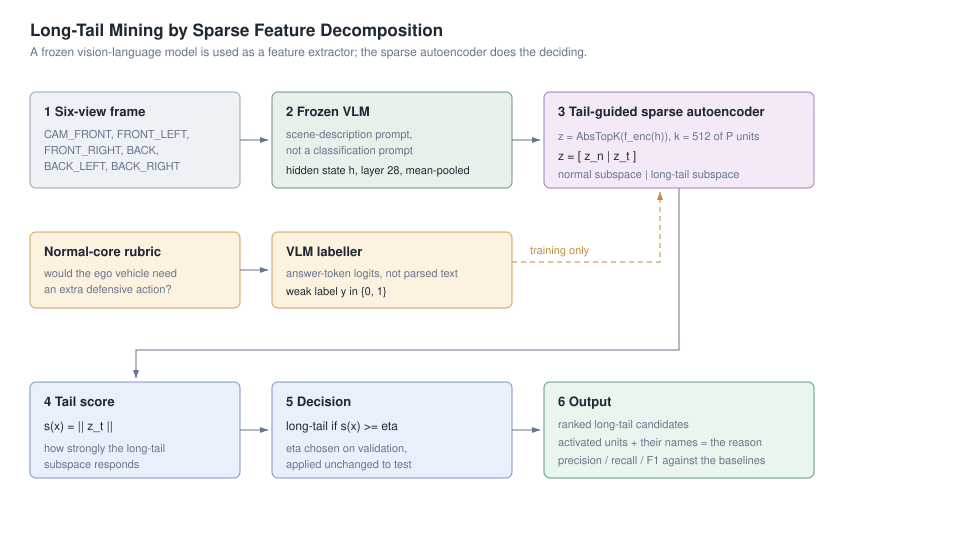

High-level Design
=============
Welcome to the long-tail driving data mining project high-level design page!

This page explains why the method is built the way it is, and gives the
equations behind the sparse decomposition.



## The problem the design is solving

Three properties of long-tail mining drive every decision.

1. **You cannot enumerate the categories in advance.** Any list of rare driving
   situations someone writes down is incomplete, and the situations that hurt
   most are often the ones nobody thought to list. So the method must not be
   built around a taxonomy.
2. **Rarity is not the target; behaviour is.** A visually unusual frame is not
   necessarily worth annotating, and a visually ordinary frame can be
   safety-critical. The definition therefore keys on what the ego vehicle would
   have to *do*, not on how unusual the pixels are.
3. **The signal is already inside the model, just diluted.** A pretrained VLM
   responds differently to a construction zone than to an empty road, whether
   or not you ask it to classify one. The task is to isolate that response, not
   to create it.

The answers, respectively: learn the categories as sparse latent units instead
of listing them; define long-tail by defensive-driving requirement; and operate
on hidden states rather than on the model's text output.

## Why the hidden state and not the answer

The obvious baseline is to ask the VLM directly: "is this a long-tail scene?".
The results show why that is weaker. A model's textual answer is a single
token's worth of its knowledge, squeezed through whatever decision boundary its
instruction tuning happened to install. The hidden state at a deep layer holds
far more: the same frame produces a rich response that the final answer largely
discards.

That is why the feature-extraction prompt asks for a *scene description*
rather than a classification. A classification prompt collapses the
representation towards a binary decision; a description prompt leaves the
representation spread across the aspects of the scene — weather, layout,
participants, hazards — which is what gives the SAE something to decompose.

## Sparse decomposition

The encoder maps the dense hidden feature into a wider latent code, of which
only a few units survive:

```
u = f_enc(h)
z = AbsTopK_k(u)          keep the k units with the largest |u|, zero the rest
z = [z_n, z_t]            first half: normal subspace; second half: tail subspace
h_hat = f_dec(z)
```

**Why AbsTopK and not Top-K.** A strongly negative activation carries as much
information as a strongly positive one — in a linear decoder it points the
reconstruction in the opposite direction with the same magnitude. Plain signed
Top-K discards those units and keeps mildly positive ones instead. The ablation
shows AbsTopK is the better rule at every layer tested.

**Why a fixed split of the latent code.** `z_t` is not discovered, it is
*declared*: the second half of the latent code is designated as the long-tail
subspace and the objective pushes long-tail structure into it. That is what
makes the score at inference time a simple norm over a known index range
instead of a learned classifier on top of the code.

## The objective

```
L_i = (1 + alpha * y_i) * ||h_hat_i - h_i||^2          reconstruction, up-weighted for tail samples
    + beta_normal * (1 - y_i) * ||z_t,i||^2            suppress z_t on normal samples
    + beta_tail   * y_i * max(0, tau - ||z_t,i||_2)    push z_t above margin tau on tail samples
```

Each term does one job. The reconstruction term keeps the code faithful to the
hidden state, so the units stay meaningful rather than degenerating into a
label detector. The suppression term makes `z_t` quiet by default, which is
what turns its activation into evidence. The reward term makes `z_t` loud on
long-tail samples, but only up to `tau` — beyond the margin there is nothing
more to gain, so the model stops inflating activations and starts spending its
capacity on *which* unit to activate. That cap is a large part of why the units
end up specialised.

In code the third term is a capped reward,
`-beta_tail * min(||z_t||, tau)`, which equals the hinge above up to a
constant, so the gradients are identical.

The supervision is weak on purpose: the objective needs only a binary label per
frame, never a box, a mask or a category. That is the difference between
labelling a few thousand frames and labelling them exhaustively.

## Scoring and the decision

```
s(x) = ||z_t||_2          y_hat = 1 if s(x) >= eta
```

`eta` is chosen on the validation split at the point of maximum F1, then
applied unchanged to the held-out test split. Choosing it on the data it is
then evaluated on would make every reported number an upper bound rather than
an estimate, which is also why the labels play no part at inference: the
screening tool reuses the stored threshold rather than re-tuning on the data
being screened.

## The evaluation protocol

Four decisions keep the numbers honest, and each one costs performance:

- **Scene-level splits.** Consecutive keyframes of one nuScenes scene are
  near-duplicates. Splitting by sample would put a frame in training and its
  neighbour in test, and the reported F1 would partly measure memorisation.
- **Training-split standardisation only.** The mean and standard deviation come
  from the training rows and are applied to all of them; computing them over
  the whole dataset leaks the test distribution into the model input.
- **`uncertain` frames excluded, not counted.** Treating everything that is not
  confidently normal as long-tail would inflate recall by construction.
- **Threshold fixed on validation, reported on test.** As above.

## Why the variants share one file

`sae_common.py` holds the model, the split, the training loop and the
evaluation; the three entry points contain nothing but a `DEFAULTS` dictionary.
An ablation is only informative if the thing being ablated is the only
difference, and the most reliable way to guarantee that is to make it
structurally impossible for the variants to drift apart.
