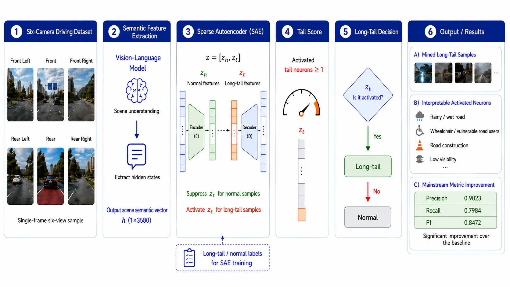

High-level Design
=============
Welcome to the long-tail driving data mining project high-level design page!

This page explains why the method is built the way it is, and gives the
equations behind the sparse decomposition. Numbers in brackets refer to the
[references on the main page](../README.md#references).



## The problem the design is solving

Three properties of long-tail mining drive every decision.

1. **You cannot enumerate the categories in advance.** Any list of rare driving
   situations someone writes down is incomplete, and the situations that hurt
   most are often the ones nobody thought to list. So the method must not be
   built around a taxonomy.
2. **Rarity is not the target; behaviour is.** A visually unusual frame is not
   necessarily worth annotating, and a visually ordinary frame can be
   safety-critical. The definition therefore keys on what the ego vehicle would
   have to *do*, not on how unusual the pixels are.
3. **The signal is already inside the model, just diluted.** A pretrained VLM
   responds differently to a construction zone than to an empty road, whether
   or not you ask it to classify one. The task is to isolate that response, not
   to create it.

The answers, respectively: learn the categories as sparse latent units instead
of listing them; define long-tail by defensive-driving requirement; and operate
on hidden states rather than on the model's text output.

## Why the hidden state and not the answer

The obvious baseline is to ask the VLM directly: "is this a long-tail scene?".
The results show why that is weaker. A model's textual answer is a single
token's worth of its knowledge, squeezed through whatever decision boundary its
instruction tuning happened to install. The hidden state at a deep layer holds
far more: the same frame produces a rich response that the final answer largely
discards.

That is why the feature-extraction prompt asks for a *scene description*
rather than a classification. A classification prompt collapses the
representation towards a binary decision; a description prompt leaves the
representation spread across the aspects of the scene — weather, layout,
participants, hazards — which is what gives the SAE something to decompose.

## Sparse decomposition

The encoder maps the dense hidden feature into a wider latent code, of which
only a few units survive:

```
u = f_enc(h)
z = AbsTopK_k(u)          keep the k units with the largest |u|, zero the rest
z = [z_n, z_t]            first half: normal subspace; second half: tail subspace
h_hat = f_dec(z)
```

**Why AbsTopK and not Top-K.** A strongly negative activation carries as much
information as a strongly positive one — in a linear decoder it points the
reconstruction in the opposite direction with the same magnitude. Plain signed
Top-K [16], [17] discards those units and keeps mildly positive ones instead;
AbsTopK [18] selects by magnitude and keeps the sign. The ablation shows
AbsTopK is the better rule at every layer tested.

**Why a fixed split of the latent code.** `z_t` is not discovered, it is
*declared*: the second half of the latent code is designated as the long-tail
subspace and the objective pushes long-tail structure into it. That is what
makes the decision at inference time a count over a known index range instead
of a learned classifier on top of the code.

## The objective

On a mini-batch of *B* samples, with *y<sub>i</sub>* = 1 for long-tail and 0
for normal,

```math
\mathcal{L} = \frac{1}{BD}\sum_{i=1}^{B} (1+\alpha y_i) \lVert \hat{h}_i - h_i \rVert_2^2
+ \frac{\beta_{\mathrm{normal}}}{|\mathcal{N}|} \sum_{i \in \mathcal{N}} \lVert z_{t,i} \rVert_2^2
- \frac{\beta_{\mathrm{tail}}}{|\mathcal{T}|} \sum_{i \in \mathcal{T}} \min\left( \lVert z_{t,i} \rVert_2 , \tau \right)
```

with *D* the feature dimension and $`\mathcal{N}`$, $`\mathcal{T}`$ the normal
and long-tail samples of the batch: reconstruction, up-weighted for long-tail
samples; suppression of `z_t` on normal samples; and a capped reward for `z_t`
activity on long-tail samples. This is exactly what
`LongTailGuidedSAE.forward` in [`scripts/sae_common.py`](../scripts/sae_common.py)
computes, with defaults α = 1, β<sub>normal</sub> = 0.1,
β<sub>tail</sub> = 0.5 and τ = 2.

Each term does one job. The reconstruction term keeps the code faithful to the
hidden state, so the units stay meaningful rather than degenerating into a
label detector. The suppression term makes `z_t` quiet by default, which is
what turns its activation into evidence. The reward term makes `z_t` loud on
long-tail samples, but only up to `tau` — beyond the margin there is nothing
more to gain, so the model stops inflating activations and starts spending its
capacity on *which* unit to activate. That cap is a large part of why the units
end up specialised.

Since −min(‖*z<sub>t</sub>*‖, τ) = max(0, τ − ‖*z<sub>t</sub>*‖) − τ, the capped
reward equals a hinge penalty β<sub>tail</sub> · max(0, τ − ‖*z<sub>t</sub>*‖) up
to a constant and has the same gradient: long-tail samples are asked for an
activation of at least τ.

The supervision is weak on purpose: the objective needs only a binary label per
frame, never a box, a mask or a category. That is the difference between
labelling a few thousand frames and labelling them exhaustively.

## The decision

```math
c_{\mathrm{tail}}(x) = \sum_{j=1}^{d_t} \mathbb{1}\left[ \lvert z_t^{(j)} \rvert > \eta \right],
\qquad
\hat{y} = \mathbb{1}\left[ c_{\mathrm{tail}}(x) \ge 1 \right],
\qquad \eta = 0.01
```

A frame is long-tail as soon as one long-tail unit fires. This follows directly
from how the subspace was trained: the suppression term drives `z_t` to exact
zeros on normal frames — AbsTopK then simply does not select those units — so
any surviving `z_t` activity is the evidence, and asking for more than one unit
would only discard long-tail frames that express a single pattern. `eta` is a
floor against numerical noise, not a tuned threshold.

Because the rule fits nothing, it cannot be tuned on the data it is evaluated
on, and the screening tool applies it to new data exactly as in training.
`||z_t||_2` is kept as a continuous score: it orders the flagged frames and
gives the threshold-free ROC AUC and average precision (AP). The rule lives in
[`scripts/tail_activations.py`](../scripts/tail_activations.py), the only place
training, screening and the explorer take it from.

A second threshold appears in the interpretability analysis, `|z_t| > 1`: a
unit counts as *firing* on a frame for the neuron statistics only above that
level, which filters the small activations that are enough for the decision but
too weak to say anything about a particular unit.

## The evaluation protocol of the released code

Four decisions keep the numbers honest:

- **Scene-level splits.** Consecutive keyframes of one nuScenes scene are
  near-duplicates. Splitting by sample can put a frame in training and its
  neighbour in test, so an F1 measured that way partly measures memorisation.
- **Training-split standardisation only.** The mean and standard deviation come
  from the training rows and are applied to all of them; computing them over
  the whole dataset leaks the test distribution into the model input.
- **`uncertain` frames excluded, not counted.** Treating everything that is not
  confidently normal as long-tail would inflate recall by construction.
- **Metrics on held-out scenes.** Validation is used to select the
  checkpoint; the metrics are computed on test scenes the model never saw,
  with the same fixed decision rule.

The numbers in the README come from a random 80/20 split over keyframes
([Data and Evaluation](../README.md#data-and-evaluation)); the scripts here
default to the scene-level protocol above.

## Why the variants share one file

`sae_common.py` holds the model, the split, the training loop and the
evaluation; the three entry points contain nothing but a `DEFAULTS` dictionary.
An ablation is only informative if the thing being ablated is the only
difference, and the most reliable way to guarantee that is to make it
structurally impossible for the variants to drift apart.
